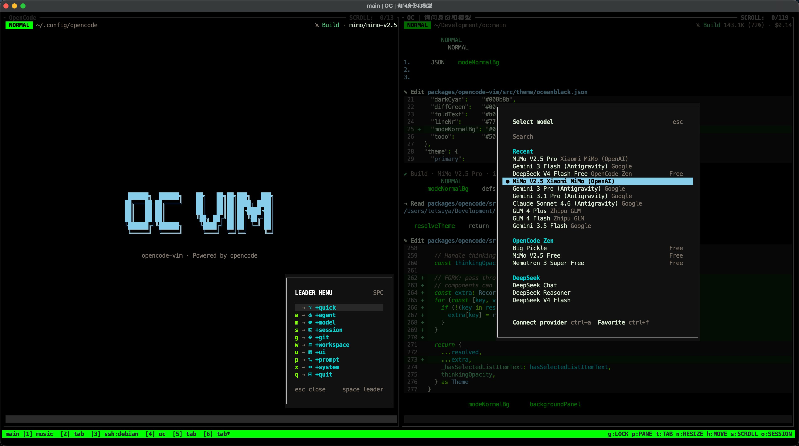

# opencode-vim

A LazyVim-inspired Vim TUI frontend for [opencode](https://github.com/anomalyco/opencode) — an open-source AI-powered development tool.

This fork adds a standalone Vim TUI (`packages/opencode-vim/`) alongside the upstream's Web, Desktop, and default TUI clients, with insert/normal mode workflow optimized for keyboard-first users.



## Fork Features

- **Vim Modes** — Insert/normal mode workflow for keyboard-first navigation
- **Leader Menu** — Right-side shortcut menu inspired by LazyVim
- **Compact Interface** — Streamlined layout with model info, token usage, and spinner always visible
- **Usage Display** — Token usage shown alongside model variant in the info line
- **Animated Spinner** — Inline braille spinner during busy/retry states
- **Custom Prompt Component** — Forked from upstream to minimize merge conflicts on compact-mode changes
- **Lightweight** — Small fork-owned frontend surface, fast startup

## Building

```bash
bash fork/build.sh
```

Produces the `opencode-vim` binary in `fork/dist/`.

## Running

```bash
opencode-vim [project]
```

Starts the Vim TUI in the current directory or the specified project.

## Testing

```bash
cd packages/opencode-vim
bun test
```

## Syncing with Upstream

```bash
bash fork/update.sh
```

Fetches and merges changes from `upstream/dev`, rebuilds, and refreshes root files (README, AGENTS, models snapshot).

## Root Project

The wider monorepo at `packages/*` matches upstream opencode:

| Package | Description |
|---------|-------------|
| `opencode` | Default TUI, core CLI |
| `app` | Web frontend (SolidStart) |
| `desktop` | Electron desktop app |
| `core` | Shared types, models, utilities |
| `ui` | Shared UI components (SolidJS) |
| `llm` | LLM provider integrations |
| `sdk/js` | JavaScript SDK |
| `opencode-vim` | **Fork — Vim TUI frontend** |

## License

Same as upstream [opencode](https://github.com/anomalyco/opencode) — MIT.
