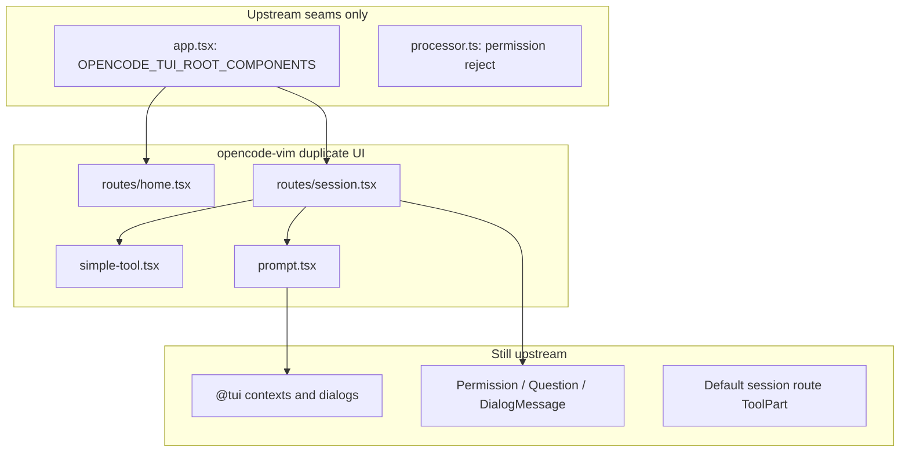

# [202606052006]_upstream-conflict-risk-map

## Why

Fork Vim/minimal behavior used to live in `packages/opencode/src/**`, which caused merge pain on every `upstream/dev` sync. Most UI and config behavior now lives in `packages/opencode-vim/`. A **small, frozen set** of upstream seams remains because upstream declined official extension hooks.

## Enforcement

- Allowlist: `fork/upstream-seams.allowlist` (currently **2 files**).
- Check: `bash fork/check-upstream-seams.sh` (also runs from `fork/build.sh`, `fork/update.sh`, pre-commit, CI).
- Do **not** add new fork logic under `packages/opencode/src/**` unless the allowlist is updated deliberately.

## Remaining Upstream Seams (required)

### `packages/opencode/src/cli/cmd/tui/app.tsx`

| Seam | Mechanism | Fork owner |
|------|-----------|------------|
| Root routes | `globalThis.OPENCODE_TUI_ROOT_COMPONENTS` → `MinimalHome` / `MinimalSession` | `opencode-vim/src/root-components.ts` |
| Renderer | `OPENCODE_MINIMAL_*` env in `tuiRendererConfig()` | `opencode-vim/src/runtime.ts` |
| Updates | `OPENCODE_MINIMAL_DISABLE_UPDATE_CHECK` skips install prompts | `opencode-vim/src/runtime.ts` |

Merge rule: take upstream for normal TUI/layout changes; keep only blocks marked `FORK-SEAM (opencode-vim)`.

Upstream PR for official hooks was declined — this global/env seam stays until upstream changes policy.

### `packages/opencode/src/session/processor.ts`

| Seam | Behavior |
|------|----------|
| Permission reject | `ctx.blocked = false` so the user can keep chatting after rejecting a permission |

Merge rule: keep upstream processor structure; preserve only the `PermissionV1.RejectedError` branch that clears `ctx.blocked`. Question reject stays upstream (`ctx.blocked = ctx.shouldBreak`).

Cannot move to `opencode-vim` without duplicating the processor or patching core session runtime.

## Reference `@alias/path` (fork-owned)

`@alias/subpath` mentions in vim prompt text are expanded in `packages/opencode-vim/src/session/reference-prompt-parts.ts` before `session.prompt`. `@alias` without a subpath stays on upstream `resolveReferenceParts(part.text)` after submit.

## Moved to Fork (do not re-add upstream)

| Was upstream | Now fork-owned |
|--------------|----------------|
| `session/index.tsx` `export context` | `opencode-vim/src/context/session-context.ts` |
| `theme.tsx` `OPENCODE_MINIMAL` | `opencode-vim/src/util/theme.ts` (`useForkTheme`, `MinimalRendererBackground`) |
| `edit.ts` diff in tool output | `SimpleTool` via `metadata.diff` |
| `config.ts` providers default override | `opencode-vim/src/sdk/install-patches.ts` + `util/config-model-default.ts` |
| prompt, sidebar, cli, model-select, dialogs, autocomplete | `packages/opencode-vim/src/**` (see list below) |

## Recently Moved Out Of Upstream (guard list)

Do not add fork-only behavior back into:

- `packages/opencode/src/cli/cmd/cli.ts`
- `packages/opencode/src/cli/cmd/model-select.ts`
- `packages/opencode/src/cli/cmd/tui/component/dialog-skill.tsx`
- `packages/opencode/src/cli/cmd/tui/ui/dialog-select.tsx`
- `packages/opencode/src/cli/cmd/tui/ui/dialog.tsx`
- `packages/opencode/src/cli/cmd/tui/routes/session/sidebar.tsx`
- `packages/opencode/src/cli/cmd/tui/component/prompt/autocomplete.tsx`
- `packages/opencode/src/cli/cmd/tui/component/prompt/index.tsx`

Fork implementations: `opencode-vim/src/cli.ts`, `model-select.ts`, `component/*`, `routes/*`.

## Fork Duplicate Inventory (minimal / Vim path)

When `OPENCODE_TUI_ROOT_COMPONENTS` is set (via `opencode-vim` startup), the TUI uses fork-owned routes and components below. These are **upstream-equivalent behavior maintained in fork** to avoid editing large upstream files. They are not byte-for-byte copies; expect manual porting when upstream changes tool UI, prompt, or session layout.

### Still shared with upstream (not duplicated)

| Area | Location | Notes |
|------|----------|-------|
| TUI infrastructure | `@tui/context/*`, `@tui/ui/dialog*`, `@tui/keymap`, borders, spinners | Imported by fork routes and prompt |
| Session dialogs / prompts | Re-exported from `@tui/routes/session/*` via `opencode-vim/src/upstream/session.ts` | `DialogMessage`, `PermissionPrompt`, `QuestionPrompt`, `SubagentFooter` |
| Default full TUI | `packages/opencode/src/cli/cmd/tui/routes/session/index.tsx` | Full `ToolPart` + per-tool renderers; used when **not** in minimal mode |
| Diff viewer plugin | `packages/opencode/src/cli/cmd/tui/feature-plugins/system/diff-viewer.tsx` | Restored to upstream; fork does not fork this file |
| Locale helper | `opencode-vim/src/util/locale.ts` | Re-exports `packages/opencode/src/util/locale.ts` |
| Thread bootstrap | `opencode-vim/src/upstream/thread.ts` | Re-exports `TuiThreadCommand` |

### UI duplicates (fork maintains; upstream file still exists for default TUI)

| Fork file | Upstream counterpart | Role |
|-----------|---------------------|------|
| `routes/home.tsx` | TUI home route | Minimal home shell |
| `routes/session.tsx` (~774 lines) | `routes/session/index.tsx` (~2500 lines, subset) | Message list; `CompactTextPart` / `CompactReasoningPart` use `<markdown>` |
| `component/simple-tool.tsx` (~579 lines) | `session/index.tsx` tool section (`ToolPart`, `Shell`, `Read`, `Edit`, `GenericTool`, …) | Single component replaces per-tool UI; edit uses `<diff>` + `metadata.diff` |
| `component/prompt.tsx` (~2100 lines) | `component/prompt/index.tsx` (~1700 lines) | Prompt editor; Vim bindings, `@alias/path` pre-expand |
| `component/autocomplete.tsx` | `component/prompt/autocomplete.tsx` | Mention / command autocomplete for fork prompt |
| `component/sidebar.tsx` | `routes/session/sidebar.tsx` | Session sidebar; fork adds `compact` / `bare` / `hideFooter` |
| `component/dialog-skill.tsx` | `component/dialog-skill.tsx` | Skill picker; fork adds `initialFilter`; uses upstream `DialogSelect` |
| `cli.ts` | Former `cli/cmd/cli.ts` (fork-only registration now) | Headless / CLI session tool output (separate from TUI `SimpleTool`) |
| `model-select.ts` | Former `cli/cmd/model-select.ts` | Model selection command |

### Behavior moved to fork (not full-page UI copies)

| Fork | Was upstream |
|------|--------------|
| `context/session-context.ts` | `session/index.tsx` exported `SessionContext` |
| `util/theme.ts`, `util/theme-minimal.ts`, `theme/oceanblack.json` | `theme.tsx` `OPENCODE_MINIMAL` branches |
| `session/reference-prompt-parts.ts` | `session/prompt.ts` `@alias/subpath` expansion |
| `sdk/install-patches.ts`, `sdk/patch-config-providers.ts`, `util/config-model-default.ts` | `handlers/config.ts` default model on providers |

### Fork-only (not upstream mirrors)

`feature/vim-mode.tsx`, `feature/copy-mode.ts`, `feature/leader-menu.ts`, `component/minimal-layout.tsx`, `component/header.tsx`, `component/recent-sessions.tsx`, `runtime.ts`, `root-components.ts`, `session-navigation.ts`, `config/vim.ts`, `context/autocomplete-host.tsx`, `context/minimal.ts`.

### Tool + markdown rendering (quick map)

| Capability | Minimal (fork) | Default TUI (upstream) |
|------------|----------------|------------------------|
| Assistant text markdown | `routes/session.tsx` → `<markdown>` | `session/index.tsx` text parts |
| Tool blocks | `SimpleTool` | `ToolPart` + per-tool functions |
| Edit diff display | `SimpleTool` + `<diff>` + `metadata.diff` | `Edit()` + diff-viewer plugin |
| Prompt `@` completion | `component/autocomplete.tsx` | `component/prompt/autocomplete.tsx` |
| Non-TUI tool printing | `cli.ts` | N/A in upstream tree at old path |

### Drift maintenance

- **High drift risk**: `simple-tool.tsx`, `prompt.tsx`, `autocomplete.tsx` — port upstream tool/prompt/session UI changes by hand.
- **Low drift risk**: `upstream/session.ts`, `util/locale.ts` (re-exports only).
- **Upstream diff target**: only `app.tsx` and `processor.ts` under `packages/opencode/src` (enforced by `fork/check-upstream-seams.sh`).

## Fork-Owned Areas (default keep fork on conflict)

- `fork/**`
- `packages/opencode-vim/**`
- `packages/miniapps/**`
- `packages/bedrock-scanner/**`
- `.oc/**`
- `patches/**`

## Root / Dependency

- `package.json`, `bun.lock`: take upstream dependency versions first, then restore fork workspaces (`opencode-vim`, `miniapps/*`, `bedrock-scanner`).
- After sync: `bun install --lockfile-only`, `cd packages/opencode-vim && bun typecheck && bun test`, `bash fork/build.sh`.

## Lessons

- `Updated upstream` / `Stashed changes` after `fork/update.sh` often means stash restore, not a bad merge commit.
- Adapter boundary: `packages/opencode-vim/src/upstream/**` only.
- Upstream official extension PR was declined; env + global seams are intentional.