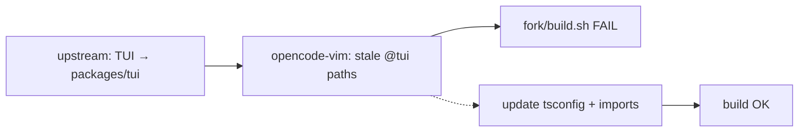

# [202606082200] TUI package migration — opencode-vim build fix

## Summary

After merging upstream `dev`, `bash fork/build.sh` failed while compiling `opencode-vim`. The root cause was upstream extracting the terminal UI into `packages/tui` (`@opencode-ai/tui`). Fork-owned Vim UI still imported deleted modules and old path aliases.

Build is restored by updating `packages/opencode-vim` imports and `@tui/*` tsconfig paths. This doc records what broke, what we changed, and what conflict surface remains.

## What broke

Upstream landed the TUI package extraction (`specs/tui-package.md`):

- Canonical TUI code moved from `packages/opencode/src/cli/cmd/tui/**` to `packages/tui/src/**`.
- Package name: `@opencode-ai/tui`.
- `opencode` and `cli` now depend on that package instead of in-tree TUI sources.

`fork/build.sh` compiles `packages/opencode-vim/src/index.ts` with Bun using `packages/opencode-vim/tsconfig.json`. That file still mapped:

```json
"@tui/*": ["../opencode/src/cli/cmd/tui/*"]
```

Bun could not resolve modules that no longer exist at the old paths.

### First errors (representative)

```
Could not resolve: "@tui/context/tui-config"
Could not resolve: "@tui/context/exit"
Could not resolve: "@opencode-ai/tui/plugin/runtime"
```

Additional failures appeared after fixing those (border, prompt helpers, editor, clipboard, format, display).

## Root causes (two layers)

### 1. Path alias lag

`@tui/*` must point at the new package:

```json
"@tui/*": ["../tui/src/*"]
```

Without this, every `@tui/...` import in `opencode-vim` fails at compile time.

### 2. API and module moves during extraction

| Old import / API | New location / API |
|------------------|-------------------|
| `@tui/context/tui-config` | `@tui/config` (`useTuiConfig`) |
| `@tui/context/exit` | Removed. Session: `useEpilogue` + `sessionEpilogue`. Prompt quit: `destroyRenderer(renderer)` |
| `TuiPluginRuntime.Slot` | `usePluginRuntime().Slot` from `@tui/plugin/runtime` |
| `@tui/component/prompt/*` | `@tui/prompt/*` (history, traits, part, stash, frecency, display) |
| `@tui/component/border` | `@tui/ui/border` |
| `@tui/util/editor` | `@tui/editor` (`openEditor`) |
| `@tui/util/clipboard` | `@tui/clipboard` (`read`) |
| `TuiEvent.PromptAppend.type` | String event name `"tui.prompt.append"` |
| `@/util/format` | `@tui/util/format` (moved out of `packages/opencode`) |
| `@/cli/cmd/prompt-display` | `@tui/prompt/display` |
| `@opencode/cli/cmd/tui/thread` | `@opencode/cli/cmd/tui` |
| `nonTextParts.map(assign)` | `...nonTextParts` (`assign` removed upstream) |

## Files changed in opencode-vim

| File | Change |
|------|--------|
| `tsconfig.json` | `@tui/*` → `../tui/src/*` |
| `src/upstream/thread.ts` | `TuiThreadCommand` import path |
| `src/routes/session.tsx` | `useEpilogue`, `sessionEpilogue`, `onCleanup` |
| `src/component/prompt.tsx` | Full import migration + quit/append behavior |
| `src/component/autocomplete.tsx` | `@tui/prompt/*`, `@tui/prompt/display` |
| `src/component/minimal-layout.tsx` | `usePluginRuntime()` |
| `src/component/sidebar.tsx` | `usePluginRuntime()`, `@tui/config` |
| `src/context/session-context.ts` | Type import from `@tui/config` |

## Fork infrastructure updates (same incident)

| File | Change |
|------|--------|
| `fork/upstream-seams.allowlist` | Seam host: `packages/tui/src/app.tsx` (was `.../cli/cmd/tui/app.tsx`) |
| `fork/check-upstream-seams.sh` | Search `packages/tui/src`; required seams on new paths; drift includes `packages/tui/src` |
| `fork/AGENTS.md` | Document new seam path |
| `fork/docs/202606052006_upstream-conflict-risk-map.md` | Refresh paths after TUI extraction |

## Validation

```bash
bash fork/check-upstream-seams.sh
cd packages/opencode-vim && bun test
bash fork/build.sh
```

- Seam check: allowlist OK (2 files), drift OK.
- `opencode-vim` tests: 12/12 pass.
- Build: `opencode` and `opencode-vim` binaries smoke-test OK.

Note: `cd packages/opencode-vim && bun typecheck` may still report errors in `packages/tui` and `packages/core` — repo-wide type debt, not introduced by this fix.

## Remaining upstream conflict surface

### A. Intentional upstream seams (merge every sync)

| File | Fork behavior |
|------|---------------|
| `packages/tui/src/app.tsx` | `OPENCODE_TUI_ROOT_COMPONENTS`, `OPENCODE_MINIMAL_*`, skip update prompts |
| `packages/opencode/src/session/processor.ts` | Permission reject sets `ctx.blocked = false` |

Merge rule: take upstream layout/logic; preserve blocks marked `FORK-SEAM (opencode-vim)`.

### B. Fork duplicate UI (high manual port risk)

Maintained in `packages/opencode-vim` to avoid editing large upstream files:

- `component/prompt.tsx` — **highest drift** (this incident)
- `component/autocomplete.tsx`
- `component/simple-tool.tsx`
- `routes/session.tsx`, `component/sidebar.tsx`

When upstream changes prompt, tool rendering, or session layout in `packages/tui`, port by hand into these fork files.

### C. Shared `@tui/*` dependency (~15 files, 80+ imports)

`opencode-vim` still imports contexts, dialogs, keymap, spinners, etc. from `@tui/*`. Any future internal rename in `packages/tui` can break the fork build again.

Adapter boundary (update first on upstream refactors):

- `packages/opencode-vim/src/upstream/thread.ts` — bootstrap command
- `packages/opencode-vim/src/upstream/session.ts` — session dialogs re-exports

### D. Post-sync checklist

1. `bash fork/check-upstream-seams.sh` — seams in allowlist only; drift limited to allowlist (+ `upstream-drift.allowlist` if used).
2. `bash fork/build.sh` — both binaries compile.
3. `cd packages/opencode-vim && bun test`.
4. If upstream touched prompt: compare `packages/tui/src/component/prompt/index.tsx` with `packages/opencode-vim/src/component/prompt.tsx` (`fork/update.sh` warns when paths differ).

## Diagram



## Lessons

- TUI extraction moves the **fork seam** from `packages/opencode/.../tui/app.tsx` to `packages/tui/src/app.tsx`. Update allowlist, seam checks, and docs in the same commit as the merge.
- `@tui/*` in `opencode-vim` is a **compile-time coupling** to `packages/tui` internals, not only to published `@opencode-ai/tui` exports. Path or API moves require fork follow-up.
- Prefer aligning fork behavior with upstream equivalents (`useEpilogue`, `destroyRenderer`, `usePluginRuntime`) rather than keeping deleted APIs (`useExit`, `TuiPluginRuntime`).